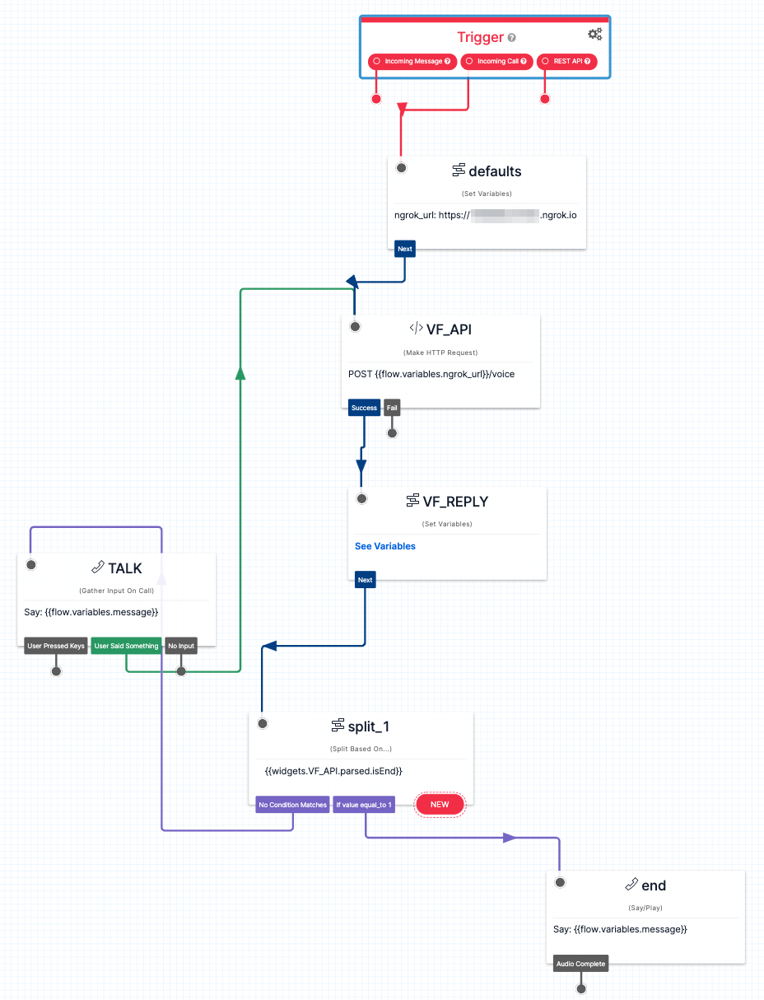

# voiceflow-twilio

# ** このレポジトリはアーカイブされています / This repository has been archived **

**Dialog Management APIができたので、Voiceflow SDKはobsoletedとなったそうです。本レポジトリのコードは動かない可能性がありますのでアーカイブしました。（Dialog Management APIにあわせた新しいSDKがそのうちリリースされるらしいです。）**

**This repository has been archived because Voiceflow SDK has been replaced with Dialog Management API and obsoleted now. These codes may not work. (I heard that a New SDK suitable for Dialog Management API will be released in future.) **

## About

Voiceflow SDKを使った、Twilio IVRチャットボットのサンプルです。

demo for node.js/express server for running a Twilio IVR chatbot with Voiceflow SDK.




## Usage

```
git clone https://github.com/kun432/voiceflow-twilio.git
cd voiceflow-twilio
npm install
```

ディレクトリにあるcoffeeshop.vfをVoiceflowでインポートし、Voiceflow SDK用のバージョンIDとAPIキーを取得、これも環境変数で設定しておく

```
export VF_VERSION_ID="XXXXX...XXXXX"
export VF_API_KEY="VF.XXXXX...XXXXX"
```

ローカルでアプリとngrokを起動

```
node .
ngrok http 3000
```

ngrokで生成されたURL を控えておく。

Twilio Studioのjsonファイルを開いて、ngrokのURLを修正

```
      "properties": {
        "variables": [
          {
            "value": "https://XXXXXXXXXXXX.ngrok.io",
            "key": "ngrok_url"
          }
        ],
```

Twilio

- Phone Numbersで電話番号を購入
- Studioで新規フロー作成、twilio-studio.jsonをインポート
- 購入した電話番号の設定を開いて、"A CALL COMES IN"を以下のように変更して保存
  - 種類は "Studio Flow" を選択
  - フローは "VF_SDK_SAMPLE" を選択
